# Laboratorio 07 — Fundamentos de Seguridad en Aplicaciones Web con Spring Security

**Curso:** Desarrollo de Aplicaciones Web Avanzado
**Tema:** Implementación de Seguridad Básica (autenticación y autorización por roles)

---

## 1. Qué se hizo

Se desarrolló una **API REST segura** con **Spring Boot + Spring Security**, aplicando
autenticación **Basic Auth** y autorización por **roles**. El proyecto se generó con
Spring Initializr (Maven, Java 21) con las dependencias *Web, Data JPA, Security, MySQL y Lombok*,
y se conecta a una base de datos **MySQL (XAMPP)** llamada `securitydb`.

Componentes principales:

- **`SecurityConfig`** — define el `SecurityFilterChain`: rutas públicas, protegidas por rol,
  Basic Auth y `BCryptPasswordEncoder` para el cifrado de contraseñas.
- **`UserDetailsServiceImpl`** — carga el usuario desde la base de datos y arma sus *authorities* (roles).
- **`User` / `Role`** — entidades JPA con relación `@ManyToMany` (tabla `user_roles`).
- **`DataLoader`** — crea al iniciar los roles, los usuarios y sus contraseñas cifradas.
- **Controladores** — `PublicController`, `UserController`, `AdminController`, `ManagerController`.

### Actividad aplicada

| Punto de la guía | Implementación |
|---|---|
| 1. Cambiar rutas | `/admin/panel`→`/management/dashboard`, `/user/dashboard`→`/client/home`, `/public/hello`→`/api/free` |
| 2. Nuevo rol | `ROLE_MANAGER` |
| 3. Nuevo usuario | `manager` |
| 4. Nuevo endpoint | `/manager/reportes` |
| 5. Cambiar contraseñas | `user/user2026`, `admin/admin2026`, `manager/manager2026` (cifradas con BCrypt) |
| 6. Pruebas en Postman | 12 pruebas — ver evidencias |

**Usuarios y permisos:**

| Usuario | Contraseña | Rol | Acceso |
|---|---|---|---|
| user | user2026 | ROLE_USER | `/client/**` |
| admin | admin2026 | ROLE_ADMIN | `/management/**`, `/manager/**`, `/client/**` |
| manager | manager2026 | ROLE_MANAGER | `/manager/**` |

---

## 2. Evidencias (pruebas en Postman)

### Endpoints públicos — 200

**`GET /api/free` sin autenticación → 200 OK**

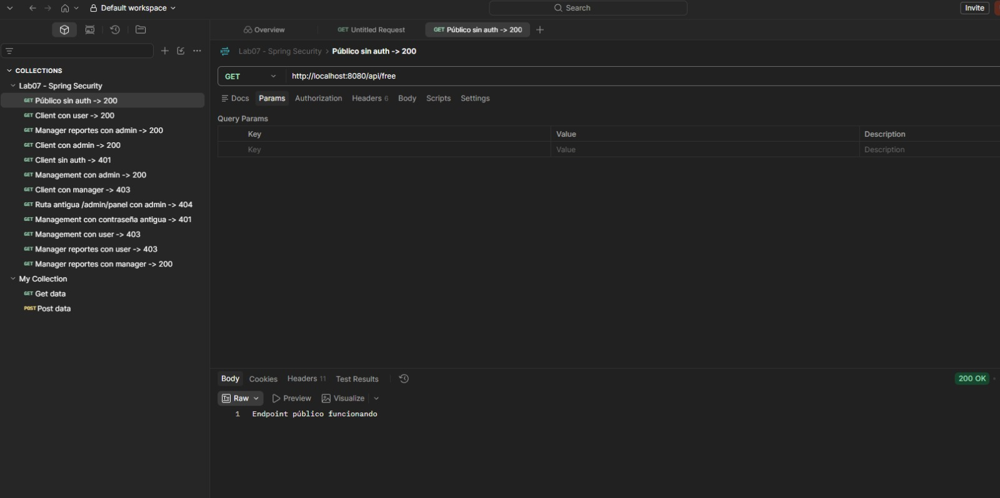

### Acceso según rol — 200

**`GET /client/home` con `user` → 200 OK**

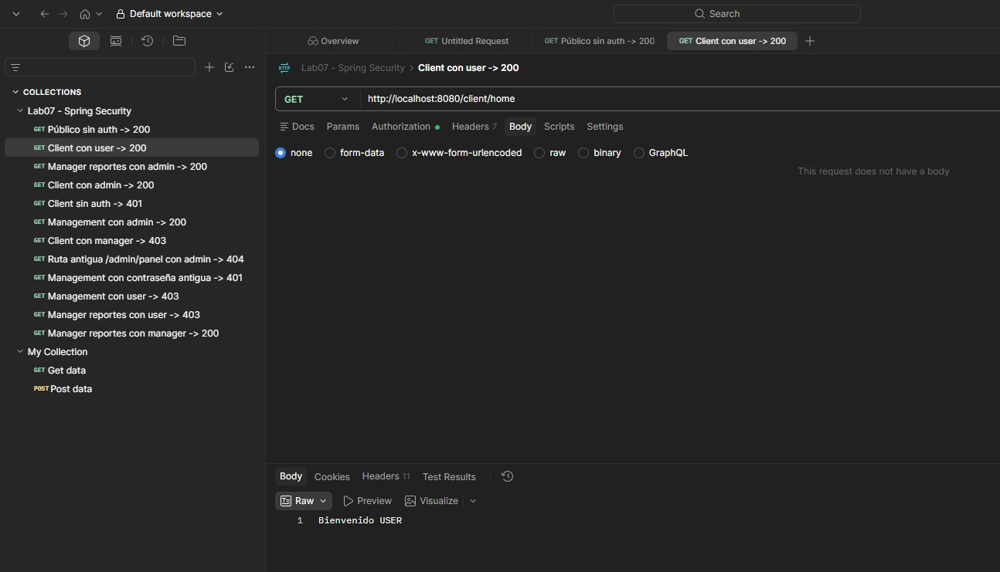

**`GET /client/home` con `admin` → 200 OK**

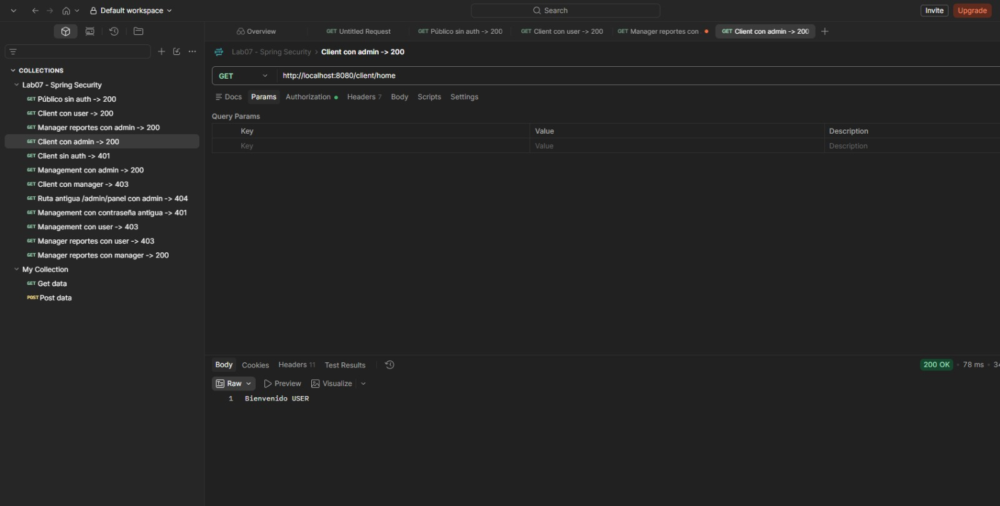

**`GET /management/dashboard` con `admin` → 200 OK**

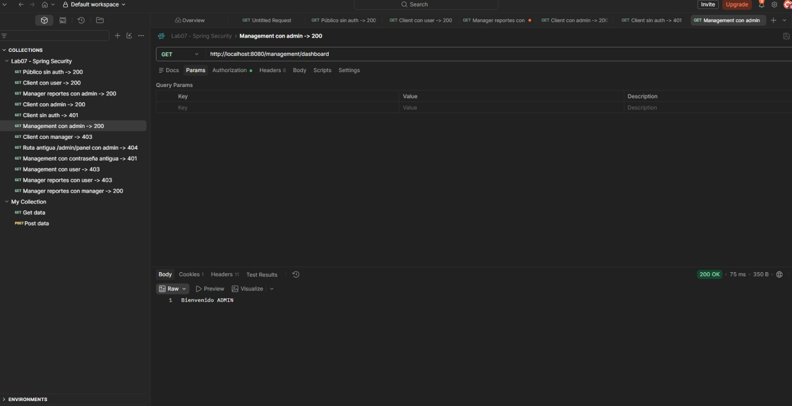

**`GET /manager/reportes` con `manager` → 200 OK**

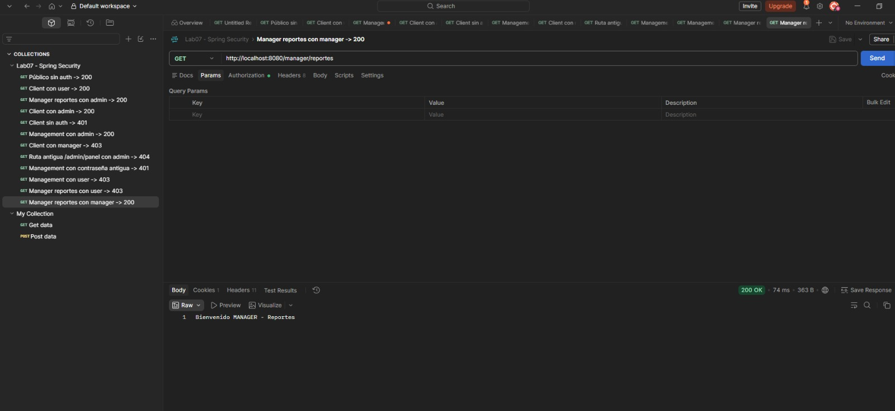

**`GET /manager/reportes` con `admin` → 200 OK**

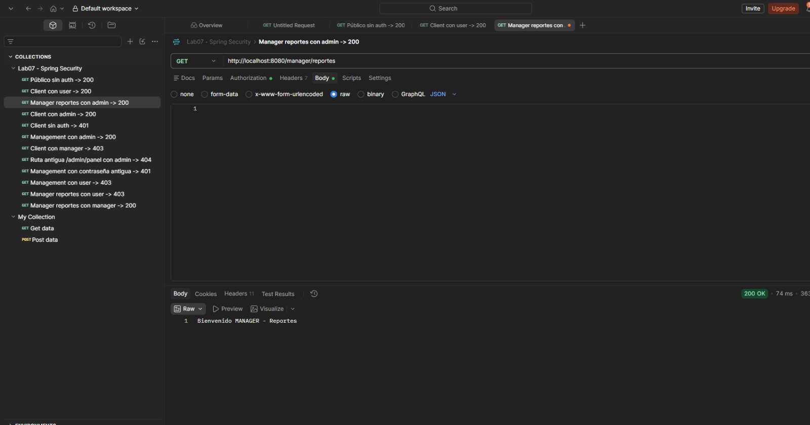

### Sin credenciales — 401 Unauthorized

**`GET /client/home` sin autenticación → 401**

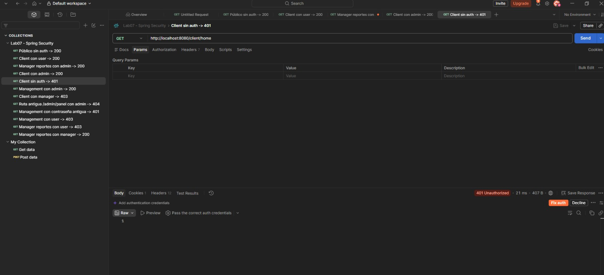

**`GET /management/dashboard` con contraseña antigua → 401**

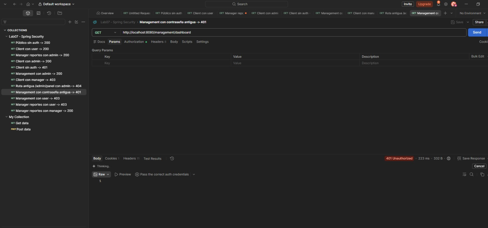

### Rol sin permiso — 403 Forbidden

**`GET /client/home` con `manager` → 403**

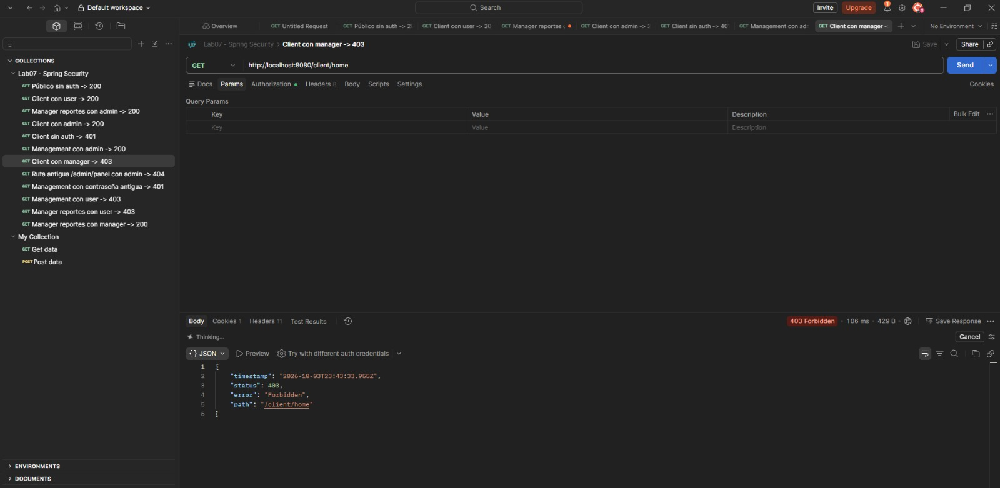

**`GET /management/dashboard` con `user` → 403**

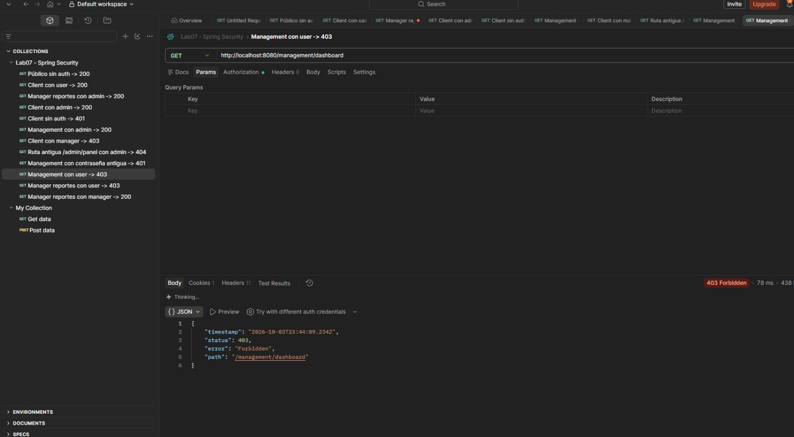

**`GET /manager/reportes` con `user` → 403**

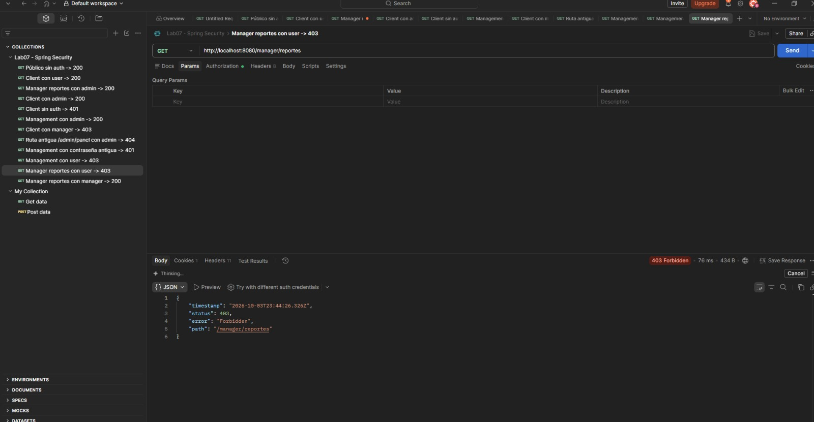

### Ruta antigua eliminada — 404 Not Found

**`GET /admin/panel` (ruta vieja) con `admin` → 404**

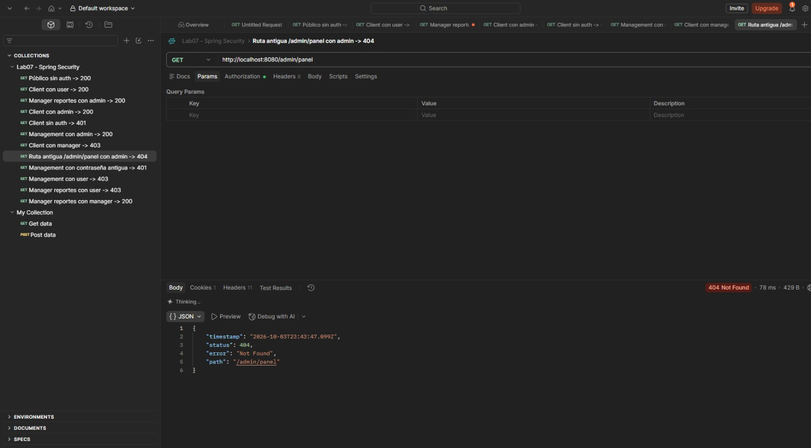

---

## 3. Resumen de resultados

| # | Prueba | Esperado | Resultado |
|---|--------|----------|-----------|
| 1 | `/api/free` sin auth | 200 | ✅ 200 |
| 2 | `/client/home` con user | 200 | ✅ 200 |
| 3 | `/client/home` con admin | 200 | ✅ 200 |
| 4 | `/client/home` sin auth | 401 | ✅ 401 |
| 5 | `/client/home` con manager | 403 | ✅ 403 |
| 6 | `/management/dashboard` con admin | 200 | ✅ 200 |
| 7 | `/management/dashboard` con user | 403 | ✅ 403 |
| 8 | `/management/dashboard` contraseña antigua | 401 | ✅ 401 |
| 9 | `/manager/reportes` con manager | 200 | ✅ 200 |
| 10 | `/manager/reportes` con admin | 200 | ✅ 200 |
| 11 | `/manager/reportes` con user | 403 | ✅ 403 |
| 12 | `/admin/panel` (ruta antigua) | 404 | ✅ 404 |

Las 12 pruebas respondieron con el código HTTP esperado, confirmando el correcto
funcionamiento de la autenticación (401), la autorización por roles (403), el acceso
permitido (200) y la eliminación de las rutas anteriores (404).

---

## 4. Observaciones

1. **Conflicto de puerto 3306.** El MySQL de Windows (servicio *MySQL80*) y el MySQL de XAMPP usan el mismo puerto; solo uno puede estar activo a la vez. Se trabajó con el de XAMPP (usuario `root` sin contraseña).
2. **Hashes BCrypt no reversibles.** Aunque la contraseña sea la misma, BCrypt genera un hash distinto cada vez (`$2a$10$...`); en la base de datos no se puede leer la contraseña en texto plano.
3. **Diferencia entre 401 y 403.** El `401 Unauthorized` aparece cuando faltan credenciales o son inválidas (p. ej. la contraseña antigua); el `403 Forbidden` cuando el usuario sí está autenticado pero su rol no tiene permiso sobre esa ruta.
4. **Rutas antiguas eliminadas.** Tras cambiar las rutas, las anteriores (`/admin/panel`, `/user/dashboard`, `/public/hello`) devuelven `404 Not Found` porque esos endpoints ya no existen.
5. **Prefijo `ROLE_`.** En la base de datos el rol se guarda con prefijo (`ROLE_MANAGER`), pero en `hasRole("MANAGER")` se escribe sin él, porque Spring Security lo agrega internamente. Además se usó **Java 21** en lugar de 25 por la versión instalada en el equipo.

## 5. Conclusiones

1. Spring Security distingue con claridad **autenticación** (quién eres) y **autorización** (qué puedes hacer), lo que se refleja directamente en los códigos `401` vs `403`.
2. El uso de **`BCryptPasswordEncoder`** protege las contraseñas al no almacenarlas nunca en texto plano, elevando la seguridad de la aplicación.
3. La configuración por roles en el **`SecurityFilterChain`** permite proteger los endpoints de forma declarativa, ordenada y fácil de mantener.
4. **Postman** resultó clave para validar cada escenario de acceso y confirmar que los códigos HTTP devueltos coinciden con lo esperado.
5. Las principales dudas (el prefijo `ROLE_`, el conflicto de puertos entre los dos MySQL y la diferencia entre `401` y `403`) se resolvieron analizando los mensajes de error y las respuestas de Postman; el laboratorio consolida el flujo completo de seguridad de una API REST.

## 6. Cómo ejecutar

```bash
# 1. Iniciar MySQL en XAMPP (la base securitydb se crea sola)
# 2. Levantar la aplicación
cd demoSeguridad01
./mvnw spring-boot:run
# 3. Importar "Lab07-SpringSecurity.postman_collection.json" en Postman y ejecutar
```
